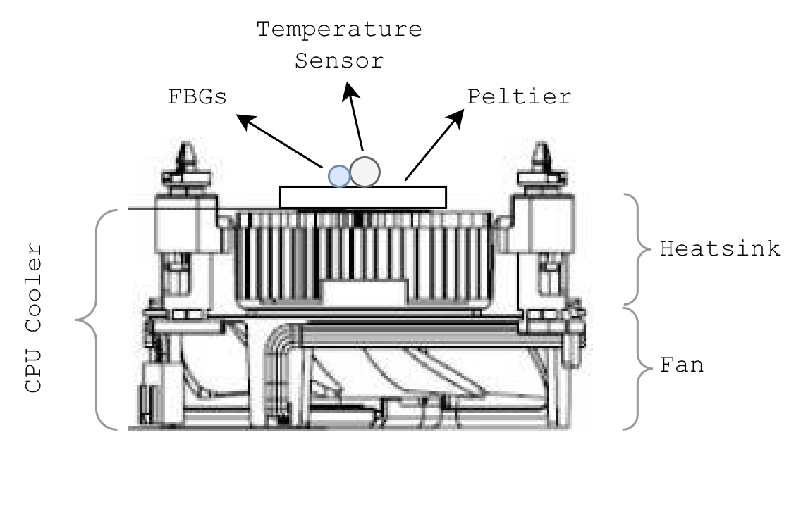
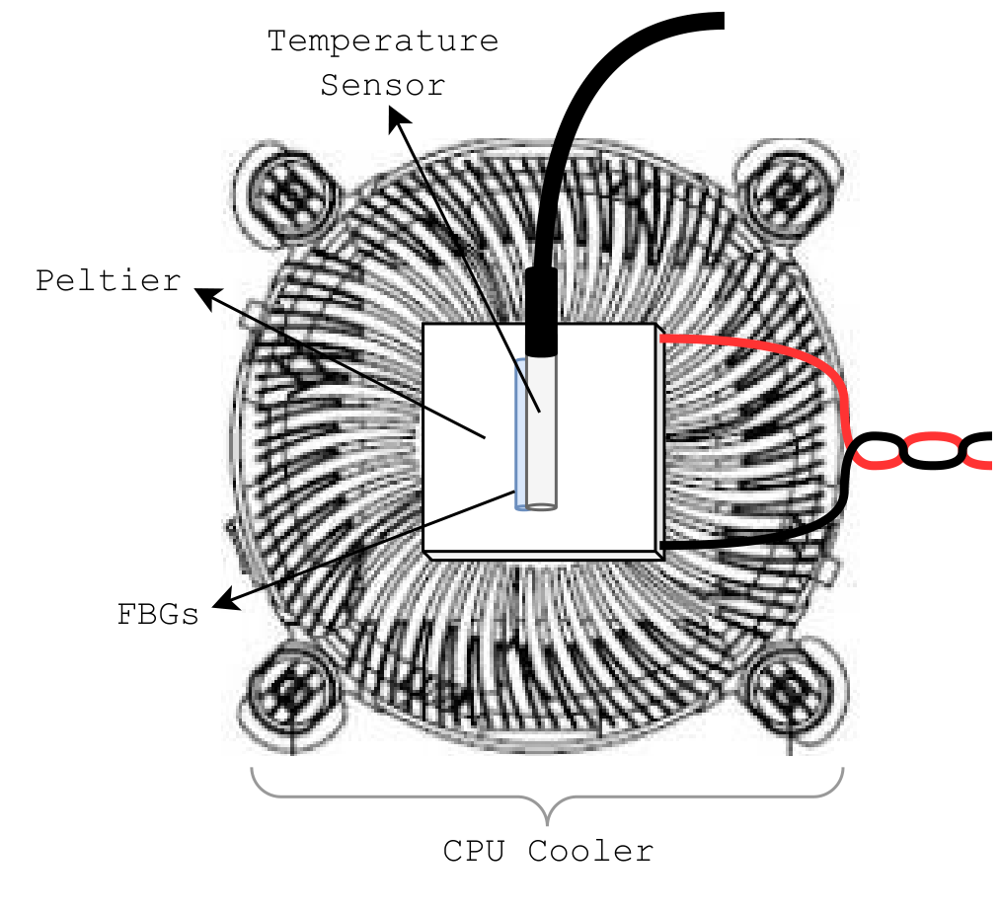

# Peltier Temperature Controller

This project has as an objective the simultaneous temperature control of two fiber Bragg gratings (FBGs), which are a type of optical fiber sensor but could be easily adapted for other requirements.

We required a high-precision temperature controller. For this, a temperature controller was designed based on a Peltier, controlled with a temperature sensor as a reference and a Proportional Integrative Derivative (PID) controller that controls the power and polarity delivered through an H-Bridge.

A Peltier is a solid-state device that transfers heat from one face to the other when electrical power is applied. If the polarity is inverted, the heat transfer direction is inverted. This allows a Peltier element to be used to either cool or heat by inverting the polarity. By attaching a Peltier over a heatsink with a fan, we set one face as a reference, to be set close to ambient temperature. Then with the Peltier, we can either raise or lower the temperature of the opposite face.

In particular, we use the cooler of a CPU, as shown in the figure below. Thermal paste is added in the interface between the heatsink and the Peltier. A temperature sensor is positioned on the top face of the Peltier with the FBGs positioned next to it. Thermal paste is added to the interface between the sensors and the Peltier, and these are fixed to the Peltier by use of insulating tape.

Temperature controller side view           |  Temperature controller top view
:-----------------------------------------:|:-----------------------------------------:
          |  

The control logic is performed by a microcontroller ($\mu$C). The information flow logic is displayed in the figure below. The polarity is set by comparing the target temperature and the ambient temperature setting the Peltier as a heater or cooler, respectively. The electrical power is controlled by a PWM signal of the microcontroller delivered to the H-Bridge. The PID updates the PWM values by looking at the difference between target temperatures and sensor temperatures. Separate PID parameters are set for cooling and heating.

**Temperature controller components and schematic.**

| Component          | Model             | Characteristics              |
|--------------------|-------------------|-------------------------------|
| Temperature Sensor | DS18B20           | $\delta t=0.06\degree C$, $\Delta T=750[ms]$ |
| H-Bridge           | L298N             | $I_{max} = 2A$ (Over 2 channels) |
| Microcontroller    | Arduino Uno R3    |                               |
| Peltier            | TEC1-12706        | $V_{nom}=12V$, $I_{max}= 6.4A$ |

